# Trabajo Práctico N°4:

Bienvenid@ al repositorio del Trabajo Práctico N°4 para la asignatura de Programación 3. En este proyecto el Grupo 6 ha desarrollado una API para integrarla a futuro con un front a desarrollar en React.

Link:

## 🎯 Objetivos del TP

- Aplicar los conocimientos vistos en clase sobre modularización, Node.js, express e
  instalación de paquetes con NPM.
- Aplicar el patrón Modelo-Vista-Controlador para separar la lógica de datos de las
  rutas.
- Aplicar conocimientos de POO (Programación Orientada a Objetos) utilizando
  Typescript.
- Diseñar y desarrollar endpoints para una API REST, utilizando los métodos ‘GET’,
  ‘POST’, ‘PUT’ y ‘DELETE’.
- Utilizar ‘Postman’ para trabajar con los métodos mencionados.
- Gestionar datos mediante archivos JSON para simular una base de datos.
- Utilizar las herramientas de ‘render.com’ para hacer un deploy de la API.
- Aplicar conocimientos de Docker.
- Trabajar en equipo utilizando herramientas de Git y GitHub.

## 👥 Integrantes - Grupo 6

- Julieta Dabús
- Alejandro Lucas Baldres
- Julian Riedinger
- Marianela Belardinelli
- Clara Zivano
- Matías F. Ledesma González

## 📋 Organización

### División del Trabajo

#### Alejandro Lucas Baldres

_Backend_

**GET /alumnos**

Adaptar el endpoint ya existente en el repo base al patrón MVC del grupo
Leer data/alumnos.json y devolver el array completo
Respuestas HTTP: 200, 500

**/notas**
Crear controlador y los routes necesarios para contener los metodos mencionados a continuacion.

**GET /notas**
Crear endpoint para obtener todas las notas  
Respuestas HTTP: 200, 500

**GET /notas/legajo**
Obtener la nota a partir del numero de legajo de un alumno  
Respuestas HTTP: 200, 404, 500

_Middleware_
Crear MiddleWare para endpoint notas

_TypeScript_

- Definir la clase AlumnoModel en alumno.model.ts. Esta clase la van a reutilizar todos los demás alumnos para validar datos
- Definir la clase numeros-magicos.ts con las constantes iniciales y extenderla en el alumno.controller y server.
- Refactorizacion de Controller a Clase TS (Estructura y metodo getAlumnos)
- Refactorizacion a TS de server.js
- Refactorizacion a TS de alumno.routes.js
- Refactorizacion a TS de app.js

_Docker_

Creación de Dockerfile para compilacion y deploy de la API.

_Postman_

Documentar GET /alumnos con ejemplo de respuesta exitosa y ejemplo de error 500

_Documentacion_

Documentar Metodo Controller y Model Persona y Alumno

#### Matías F. Ledesma González

**PATCH /alumnos/:id**  
_Backend_

Recibir el legajo por req.params y los campos a modificar por req.body
Verificar que el alumno exista, devolver 404 si no
A diferencia del PUT del Alumno 4, solo actualiza los campos que llegan en el body — los que no vienen se mantienen con su valor original
No permitir modificar el número de legajo aunque venga en el body, igual que el PUT
Guardar el JSON actualizado
Respuestas HTTP: 200, 400, 404, 500

_Postman_

Documentar con ejemplo de modificación parcial exitosa (200) — por ejemplo solo cambiando el email
Ejemplo enviando solo el legajo en el body sin otros campos (400)
Ejemplo con id inexistente (404)
Comparar en la descripción la diferencia con el PUT para que quede documentado el concepto

#### Julián Riedinger

**PUT /alumnos/:id**  
_Backend_

Recibir el legajo por req.params y los datos a modificar por req.body
Verificar que el alumno exista, devolver 404 si no
No permitir modificar el número de legajo aunque venga en el body
Actualizar los campos y guardar el JSON
Respuestas HTTP: 200, 404, 500

_Postman_

Documentar con ejemplo de modificación exitosa (200) e id inexistente (404)

#### Marianela Belardinelli

**DELETE /alumnos/:id**  
_Backend_

Recibir el legajo por req.params
Verificar que el alumno exista, devolver 404 si no
Filtrar el array para remover el alumno y guardar el JSON actualizado
Respuestas HTTP: 200, 404, 500

_Postman_

Documentar con ejemplo de eliminación exitosa (200) e id inexistente (404)

#### Clara Zivano

**POST /alumnos**  
_Backend_

Recibir datos del nuevo alumno desde req.body
Validar los campos usando AlumnoModel de TypeScript
Verificar que el legajo no exista ya en el JSON, devolver 409 si está repetido
Si todo es válido, agregar al JSON y guardar
Respuestas HTTP: 201, 400, 409, 500

_Postman_

Documentar con ejemplo de creación exitosa (201), datos inválidos (400), legajo duplicado (409)

#### Julieta Dabús

**GET /alumnos/:id**
_Backend_

Buscar en el JSON por legajo recibido en req.params
Si no existe devolver 404, si existe devolver el objeto completo
Respuestas HTTP: 200, 404, 500

_Postman_

Documentar con ejemplo de id existente (200), id inexistente (404) y error de servidor (500)

## 🛠️ Tecnologías Utilizadas

- JavaScript
- NodeJS
- Git / GitHub
- TypeScript
- Docker

## Metodologías utilizadas

Esta sección define el flujo de trabajo y las convenciones de nomenclatura para la gestión de ramas en el proyecto, asegurando un historial limpio y una integración controlada a través de GitHub.

### Estructura de Ramas Principales

El proyecto se rige por dos ramas estables de larga duración:

- Main: Es la rama principal del proyecto. Contiene la versión lista para entregar, por lo que sólo debe recibir código que haya sido probado y aprobado.
- Dev: Es la rama de integración. Aquí se consolidan todas las funcionalidades y correcciones antes de pasar a la rama principal. Es el entorno de desarrollo activo.

### Convenciones para Ramas Personales

Cada integrante del grupo trabajará en ramas creadas a partir de Dev. El nombre de estas ramas debe seguir una estructura específica según el propósito de la tarea:

A. Nuevas Funcionalidades (Features) Si la tarea consiste en agregar una nueva característica o componente al proyecto:

- Formato: feature/agregado-Iniciales
- Ejemplo: feature/formulario-JD

B. Corrección de Errores (Fixes) Si la tarea consiste en solucionar un error o realizar un ajuste técnico:

- Formato: fix/correccion-Iniciales
- Ejemplo: fix/validaciones-JD

C. Documentación (Docs) Si la tarea consiste en generar o modificar documentación:

- Formato: docs/descripcion-Iniciales
- Ejemplo: docs/readme-ALL

## Resumen de Flujo de Trabajo

1. Estar posicionado en Dev y hacer un git pull para tener lo último.
2. Crear la rama personal: git checkout -b feature/mi-tarea-AB
3. Realizar los cambios y hacer commit.
4. Subir la rama al repositorio remoto: git push --set-upstream origin feature/mi-tarea-AB
5. Abrir el Pull Request en GitHub hacia la rama Dev.
6. Realizar el Merge a la rama Dev.
7. Una vez que el código de Dev esté estabilizado y listo para generar el entregable,
   realizar el Pull Request a Main.

## Documentación Técnica

## Modelos

### nota.model

1. Constructor  
   Crea una instancia de NotaModel  
   Detalle de parametros:
   - id: id de la nota
   - idMateria: Id de la materia a la que pertenece la nota
   - nota: Nota numerica del 0 al 10
   - fecha: Fecha de la nota
   - legajo: Legajo del alumno

2. getId  
   Metodo que retorna un number con el id de la nota

```ts
1
```

3. getIdMateria  
   Metodo que retorna un String con el id de la materia

```ts
ANALISIS1
```

4. getNota  
   Metodo que retorna un number con la nota

```ts
7
```

5. getFecha  
   Metodo que retorna un Date con la fecha de la nota

```ts
'10-04-26'
```

6. getLegajo  
   Metodo que retorna un number con el legajo del alumno al cual pertenece la nota

```ts
10002
```

7. setLegajo(legajoNuevo)
   Metodo que asigna un legajo al atributo correspondiente del objeto

8. setId(id)
   Metodo que asigna un ID al atributo correspondiente del objeto

9. setIdMateria(idMateria)
   Metodo que asigna un ID de la materia al atributo correspondiente del objeto

10. setNota(nota)
    Metodo que asigna una nota al atributo correspondiente del objeto

11. setFecha(fecha)
    Metodo que asigna una fecha al atributo correspondiente del objeto

12. getAll  
    Metodo que retorna el objeto del tipo NotaModel

```json
{
  "id": 102,
  "idMateria": "PGRS10",
  "nota": 7,
  "legajo": 10003,
  "fecha": "10-04-26"
}
```

### persona.model

1. Constructor  
   Crea una instancia de PersonaModel  
   Detalle de parametros:
   - nombre: Nombre de la persona
   - apellido: Apellido de la persona
   - email: Email de la persona

2. getNombre  
   Metodo que retorna un String con el nombre de la persona

```ts
'Daniel'
```

4. getApellido  
   Metodo que retorna un String con el apellido de la persona

```ts
'Jackson'
```

5. getNombreCompleto  
   Metodo que retorna un String con el nombre completo de la persona

```ts
'Daniel Jackson'
```

6. getEmail  
   Metodo que retorna un String con el e-mail

```ts
'danieljackson@stargate.com'
```

7. getAllAttributes  
   Metodo que retorna un objeto con todos los atributos de la persona

```json
{
  "nombre": "Daniel",
  "apellido": "Jackson",
  "email": "danieljackson@stargate.com"
}
```

8. setNombre (nombre)  
   Metodo que a partir de un String recibido lo asigna al atributo nombre del objeto Persona.

9. setApellido(apellido)  
   Metodo que a partir de un String recibido lo asigna al atributo apellido del objeto Persona.

10. setEmail(email)  
    Metodo que a partir de un String recibido lo asigna al atributo email del objeto Persona.

### alumno.model

**Importante**

```
La clase AlumnoModel hereda de Persona Model
```

1. Constructor  
   Crea una instancia de AlumnoModel  
   Detalle de parametros:
   - nombre: Nombre del alumno
   - apellido: Apellido del alumno
   - email: Email del alumno
   - legajo: Legajo del Alumno
   - fechaAlta: Fecha de alta del Alumno
   - modificacion: Ultima fecha de modificación
   - activo: Flag que indica si el alumno esta activo

2. getAlumno  
   Metodo que retorna un objeto del tipo alumnoModel

```json
{
  "nombre": "Samantha",
  "apellido": "Carter",
  "email": "samanthacarter@stargate.com",
  "legajo": 1997,
  "fechaAlta": "1997-07-27",
  "modificacion": "2026-02-15",
  "activo": true
}
```

4. getAlumno  
   Metodo que retorna un Numbre con el legajo de la instancia actual.

```ts
1997
```

5. getFechaAlta  
   Metodo que retorna un Date con la fecha de alta del alumno

```ts
'1997-07-27'
```

6. getFechaModificacion  
   Metodo que retorna un Date con la fecha de la ultima modificacion

```ts
'2026-02-15'
```

7. getActivo  
   Metodo que retorna un Boolean indicando si esta activo o no

```ts
true
```

8. getAllAttributes  
   Metodo que a partir que devuelve un objeto del tipo AlumnoModel.

```json
{
  "nombre": "Samantha",
  "apellido": "Carter",
  "email": "samanthacarter@stargate.com",
  "legajo": 1997,
  "fechaAlta": "1997-07-27",
  "modificacion": "2026-02-15",
  "isActive": true
}
```

9. setLegajo(legajo)  
   Metodo que a partir de un Number recibido lo asigna al atributo legajo del objeto AlumnoModel.

10. setFechaAlta(fecha)  
    Metodo que a partir de un Date recibido lo asigna al atributo fechaAlta del objeto AlumnoModel.

11. setFechaModificacion(fecha)  
    Metodo que a partir de un Date recibido lo asigna al atributo modificacion del objeto AlumnoModel.

12. setActivo(activo)  
    Metodo que a partir de un Boolean recibido lo asigna al atributo isActive del objeto AlumnoModel.

13. setAlumno(alumno)  
    Metodo que a partir de un objeto del tipo AlumnoModel recibido asigna cada atributo del mismo a cada atributo del objeto AlumnoModel.

### profesor.model

**Importante**
La clase ProfesorModel hereda de PersonaModel

1. Constructor  
   Crea una instancia de ProfesorModel  
   Detalle de parametros:
   - nombre: Nombre del profesor
   - apellido: Apellido del profesor
   - email: Email del profesor
   - dni: DNI del profesor, utilizado como identificador único
   - cargo: Cargo del profesor (titular, adjunto, ayudante)
   - isActive: Flag que indica si el profesor está activo
   - materias: Array de ids de materias asignadas al profesor
   - fechaAlta: Fecha de alta del profesor (por defecto fecha actual)
   - modificacion: Última fecha de modificación (por defecto fecha actual)

2. getDni  
   Método que retorna un Number con el DNI de la instancia actual.

```ts
28456123
```

3. getCargo  
   Método que retorna un String con el cargo del profesor.

```ts
'titular'
```

4. getFechaAlta  
   Método que retorna un String con la fecha de alta del profesor.

```ts
'2024-03-01'
```

5. getModificacion  
   Método que retorna un String con la fecha de la última modificación.

```ts
'2024-03-01'
```

6. getMaterias  
   Método que retorna un Array de Strings con los ids de las materias asignadas.

```ts
;['PROG1', 'LABO1']
```

7. getAllAttributes  
   Método que devuelve un objeto con todos los atributos del ProfesorModel.

```json
{
  "nombre": "Roberto",
  "apellido": "Fernández",
  "email": "r.fernandez@facultad.edu.ar",
  "dni": 28456123,
  "cargo": "titular",
  "isActive": true,
  "fechaAlta": "2024-03-01",
  "modificacion": "2024-03-01",
  "materias": ["MAT101"]
}
```

8. setDni(dni)  
   Método que a partir de un Number recibido lo asigna al atributo dni del objeto ProfesorModel.

9. setCargo(cargo)  
   Método que a partir de un String recibido lo asigna al atributo cargo del objeto ProfesorModel.

10. setFechaAlta(fechaAlta)  
    Método que a partir de un String recibido lo asigna al atributo fechaAlta del objeto ProfesorModel.

11. setModificacion(modificacion)  
    Método que a partir de un String recibido lo asigna al atributo modificacion del objeto ProfesorModel.

12. setMaterias(materias)  
    Método que a partir de un Array de Strings recibido lo asigna al atributo materias del objeto ProfesorModel.

13. setProfesor(profesor)  
    Método que a partir de un objeto del tipo ProfesorModel recibido asigna cada atributo del mismo a cada atributo del objeto ProfesorModel actual.

## Controllers

### alumno.controller

1. getAlumnos
   Obtiene todos los alumnos desde el archivo JSON y envía la respuesta HTTP.
   Retorna: Envía una respuesta JSON con el array de alumnos o un error

```json
[
  {
    "legajo": 1994,
    "nombre": "George",
    "apellido": "Hammond",
    "email": "georgehammond@stargate.com",
    "fechaAlta": "2026-03-02",
    "modificacion": "2026-03-02",
    "isActive": true
  },
  {
    "legajo": 1985,
    "nombre": "Richard Dean",
    "apellido": "Anderson",
    "email": "randerson@mcguiver.edu.ar",
    "fechaAlta": "2026-03-02",
    "modificacion": "2026-03-02",
    "isActive": true
  }
]
```
2. getAlumnoByID
   Busca y obtiene un alumno específico desde el archivo JSON a partir de su 
   legajo recibido como parámetro en la URL. Envía la respuesta HTTP correspondiente.

   Parámetros: legajo (number) — recibido por req.params

   Retorna: Envía una respuesta JSON con el objeto del alumno encontrado, 
   o un mensaje de error según el caso.

Ejemplo respuesta 200:
```json
{
  "legajo": 10001,
  "nombre": "Mora",
  "apellido": "García",
  "email": "m.garcia@facultad.edu.ar",
  "fechaAlta": "2026-03-02",
  "modificacion": "2026-03-02",
  "isActive": true
}
```
Ejemplo respuesta 404:
```json
{
  "error": "No existe el alumno con legajo 99999"
}
```
Ejemplo respuesta 500:
```json
{
  "error": "No se pudo obtener el detalle del alumno"
}
```
1. putAlumno
   Edita todos los atributos de un alumno con legajo recibido por parametros en la Request:

```
PUT http://127.0.0.1:3000/alumnos/10025
```

Retorna **404** si el alumno no existe

En caso de que el alumno exista, se requiere un body en JSON con los atributos obligatorios a modificar:

```json
{
  "nombre": "Pedro",
  "apellido": "Perez",
  "email": "pedro@gmail.com",
  "isActive": true
}
```

El metodo PUT se encarga de actualizar de forma total al alumno, mientras que el metodo PATCH se encarga de manejar las actualizaciones parciales.

### nota.controller

1. getNotas
   Obtiene todos las notas desde el archivo JSON y envía la respuesta HTTP.
   Retorna: Envía una respuesta JSON con el array de notas o un error

```json
[
  {
    "id": 1,
    "legajo": 10001,
    "idMateria": "MAT101",
    "nota": 9,
    "fecha": "03-04-24"
  },
  {
    "id": 2,
    "legajo": 10001,
    "idMateria": "PROG1",
    "nota": 8,
    "fecha": "01-07-24"
  }
]
```

2. getNotasXLegajo
   Obtiene todos las notas de acuerdo a un numero de legajo y envía la respuesta HTTP.
   Retorna: Envía una respuesta JSON con el array de notas o un error

```json
[
  {
    "id": 1,
    "legajo": 10001,
    "idMateria": "MAT101",
    "nota": 9,
    "fecha": "03-04-24"
  },
  {
    "id": 2,
    "legajo": 10001,
    "idMateria": "PROG1",
    "nota": 8,
    "fecha": "01-07-24"
  }
]
```

2. postNota
   Concatena en el archivo JSON el body enviado en el Request calculando el id y envía la respuesta HTTP.
   Retorna: Envía una respuesta JSON con el array de notas o un error

```json
{
  "legajo": 10001,
  "idMateria": "MAT101",
  "nota": 9,
  "fecha": "03-04-24"
}
```

### profesor.controller

1. getProfesores  
   Obtiene todos los profesores desde el archivo JSON y envía la respuesta HTTP.  
   Retorna: Envía una respuesta JSON con el array de profesores o un error.

```json
[
  {
    "nombre": "Roberto",
    "apellido": "Fernández",
    "email": "r.fernandez@facultad.edu.ar",
    "dni": 28456123,
    "cargo": "titular",
    "isActive": true,
    "fechaAlta": "2024-03-01",
    "modificacion": "2024-03-01",
    "materias": ["MAT101"]
  },
  {
    "nombre": "Claudia",
    "apellido": "Suárez",
    "email": "c.suarez@facultad.edu.ar",
    "dni": 31789456,
    "cargo": "titular",
    "isActive": true,
    "fechaAlta": "2024-03-01",
    "modificacion": "2024-03-01",
    "materias": ["PROG1", "LABO1"]
  }
]
```

2. getProfesorByDni  
    Obtiene un profesor específico a partir del DNI recibido por parámetro en la Request:
   GET https://tp4-grupo6.onrender.com/profesores/28456123
   Retorna **404** si el profesor no existe.  
    En caso de que el profesor exista, retorna el objeto completo:

```json
{
  "nombre": "Roberto",
  "apellido": "Fernández",
  "email": "r.fernandez@facultad.edu.ar",
  "dni": 28456123,
  "cargo": "titular",
  "isActive": true,
  "fechaAlta": "2024-03-01",
  "modificacion": "2024-03-01",
  "materias": ["MAT101"]
}
```

3. postProfesor  
    Crea un nuevo profesor a partir de los datos recibidos por body en la Request:
   POST https://tp4-grupo6.onrender.com/profesores
   Valida que el DNI no esté duplicado, retorna **409** si ya existe.  
    Valida que todos los ids de materias existan en `sys-materias.json`, retorna **400** si alguno no existe.  
    En caso de éxito se requiere un body en JSON con los atributos obligatorios:

```json
{
  "nombre": "Carlos",
  "apellido": "López",
  "email": "c.lopez@facultad.edu.ar",
  "dni": 35123456,
  "cargo": "ayudante",
  "isActive": true,
  "materias": ["PROG1"]
}
```

Retorna **201** con el profesor creado en caso de éxito.

## Postman

### Endpoint /alumnos

#### Obtener todos los alumnos

```bash
curl --location 'https://tp4-grupo6.onrender.com/alumnos'
```

Salida Exitosa (200):

```json
[
  {
    "legajo": 10001,
    "nombre": "Mora",
    "apellido": "García",
    "email": "m.garcia@facultad.edu.ar",
    "fechaAlta": "2026-03-02",
    "modificacion": "2026-03-02",
    "isActive": true
  },
  {
    "legajo": 10002,
    "nombre": "Liam",
    "apellido": "Rodríguez",
    "email": "l.rodriguez@facultad.edu.ar",
    "fechaAlta": "2026-03-02",
    "modificacion": "2026-03-02",
    "isActive": true
  },
  {
    "legajo": 10003,
    "nombre": "Julieta",
    "apellido": "Martínez",
    "email": "j.martinez@facultad.edu.ar",
    "fechaAlta": "2026-03-03",
    "modificacion": "2026-03-03",
    "isActive": false
  },
  {
    "legajo": 10004,
    "nombre": "Mateo",
    "apellido": "Pérez",
    "email": "m.perez@facultad.edu.ar",
    "fechaAlta": "2026-03-05",
    "modificacion": "2026-03-05",
    "isActive": true
  },
  {
    "legajo": 10005,
    "nombre": "Sofía",
    "apellido": "López",
    "email": "s.lopez@facultad.edu.ar",
    "fechaAlta": "2026-03-10",
    "modificacion": "2026-03-10",
    "isActive": true
  },
  {
    "legajo": 10006,
    "nombre": "Lucas",
    "apellido": "González",
    "email": "l.gonzalez@facultad.edu.ar",
    "fechaAlta": "2026-03-15",
    "modificacion": "2026-03-15",
    "isActive": true
  },
  {
    "legajo": 10007,
    "nombre": "Valentina",
    "apellido": "Sánchez",
    "email": "v.sanchez@facultad.edu.ar",
    "fechaAlta": "2026-03-20",
    "modificacion": "2026-03-20",
    "isActive": false
  },
  {
    "legajo": 10008,
    "nombre": "Benjamín",
    "apellido": "Romero",
    "email": "b.romero@facultad.edu.ar",
    "fechaAlta": "2026-03-22",
    "modificacion": "2026-03-22",
    "isActive": true
  },
  {
    "legajo": 10009,
    "nombre": "Martina",
    "apellido": "Díaz",
    "email": "m.diaz@facultad.edu.ar",
    "fechaAlta": "2026-04-01",
    "modificacion": "2026-04-01",
    "isActive": true
  },
  {
    "legajo": 10010,
    "nombre": "Thiago",
    "apellido": "Silva",
    "email": "t.silva@facultad.edu.ar",
    "fechaAlta": "2026-04-03",
    "modificacion": "2026-04-03",
    "isActive": true
  },
  {
    "legajo": 10011,
    "nombre": "Victoria",
    "apellido": "Castro",
    "email": "v.castro@facultad.edu.ar",
    "fechaAlta": "2026-04-03",
    "modificacion": "2026-04-03",
    "isActive": false
  },
  {
    "legajo": 10012,
    "nombre": "Santino",
    "apellido": "Sosa",
    "email": "s.sosa@facultad.edu.ar",
    "fechaAlta": "2026-04-06",
    "modificacion": "2026-04-06",
    "isActive": true
  },
  {
    "legajo": 10013,
    "nombre": "Delfina",
    "apellido": "Ruiz",
    "email": "d.ruiz@facultad.edu.ar",
    "fechaAlta": "2026-04-12",
    "modificacion": "2026-04-12",
    "isActive": true
  },
  {
    "legajo": 10014,
    "nombre": "Camilo",
    "apellido": "Torres",
    "email": "c.torres@facultad.edu.ar",
    "fechaAlta": "2026-04-18",
    "modificacion": "2026-04-18",
    "isActive": true
  },
  {
    "legajo": 10015,
    "nombre": "Elena",
    "apellido": "Benítez",
    "email": "e.benitez@facultad.edu.ar",
    "fechaAlta": "2026-04-20",
    "modificacion": "2026-04-20",
    "isActive": false
  },
  {
    "legajo": 10016,
    "nombre": "Felipe",
    "apellido": "Acosta",
    "email": "f.acosta@facultad.edu.ar",
    "fechaAlta": "2026-04-25",
    "modificacion": "2026-04-25",
    "isActive": true
  },
  {
    "legajo": 10017,
    "nombre": "Alma",
    "apellido": "Flores",
    "email": "a.flores@facultad.edu.ar",
    "fechaAlta": "2026-05-02",
    "modificacion": "2026-05-02",
    "isActive": true
  },
  {
    "legajo": 10018,
    "nombre": "Facundo",
    "apellido": "Morales",
    "email": "f.morales@facultad.edu.ar",
    "fechaAlta": "2026-05-04",
    "modificacion": "2026-05-04",
    "isActive": true
  },
  {
    "legajo": 10019,
    "nombre": "Isabella",
    "apellido": "Ortiz",
    "email": "i.ortiz@facultad.edu.ar",
    "fechaAlta": "2026-05-05",
    "modificacion": "2026-05-05",
    "isActive": true
  },
  {
    "legajo": 10020,
    "nombre": "Joaquín",
    "apellido": "Ramos",
    "email": "j.ramos@facultad.edu.ar",
    "fechaAlta": "2026-05-05",
    "modificacion": "2026-05-05",
    "isActive": false
  },
  {
    "legajo": 10021,
    "nombre": "Bautista",
    "apellido": "Herrera",
    "email": "b.herrera@facultad.edu.ar",
    "fechaAlta": "2026-05-08",
    "modificacion": "2026-05-08",
    "isActive": true
  },
  {
    "legajo": 10022,
    "nombre": "Lola",
    "apellido": "Medina",
    "email": "l.medina@facultad.edu.ar",
    "fechaAlta": "2026-05-10",
    "modificacion": "2026-05-10",
    "isActive": true
  },
  {
    "legajo": 10023,
    "nombre": "Juan Cruz",
    "apellido": "Vega",
    "email": "jc.vega@facultad.edu.ar",
    "fechaAlta": "2026-05-11",
    "modificacion": "2026-05-11",
    "isActive": true
  },
  {
    "legajo": 10024,
    "nombre": "Catalina",
    "apellido": "Blanco",
    "email": "c.blanco@facultad.edu.ar",
    "fechaAlta": "2026-05-12",
    "modificacion": "2026-05-12",
    "isActive": true
  },
  {
    "legajo": 10025,
    "nombre": "Tomás",
    "apellido": "Méndez",
    "email": "t.mendez@facultad.edu.ar",
    "fechaAlta": "2026-05-14",
    "modificacion": "2026-05-14",
    "isActive": true
  }
]
```

#### Screenshoot

Salida Exitosa (200):


Salida Erronea (500):
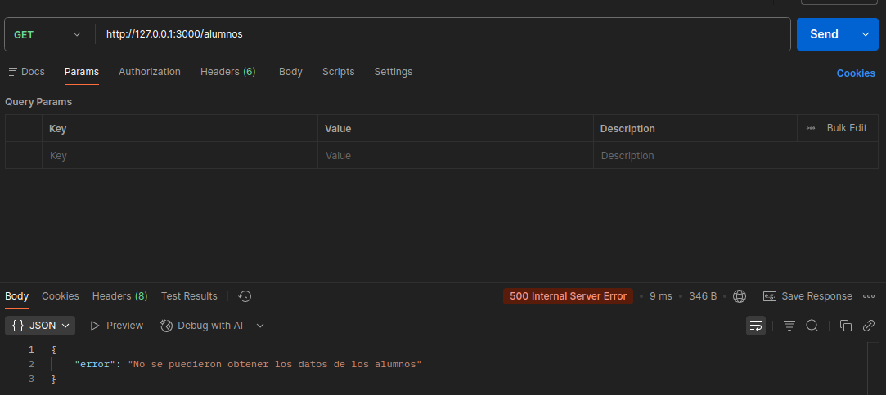

### Endpoint /notas

#### Obtener todas las notas

```bash
curl --location 'http://127.0.0.1:3000/notas'
```

Salida Exitosa (200):

```json
[
  {
    "id": 1,
    "legajo": 10001,
    "idMateria": "MAT101",
    "nota": 9,
    "fecha": "03-04-24"
  },
  {
    "id": 2,
    "legajo": 10001,
    "idMateria": "PROG1",
    "nota": 8,
    "fecha": "01-07-24"
  },
  {
    "id": 3,
    "legajo": 10002,
    "idMateria": "MAT101",
    "nota": 10,
    "fecha": "03-04-24"
  },
  {
    "id": 4,
    "legajo": 10002,
    "idMateria": "PROG1",
    "nota": 8,
    "fecha": "01-07-24"
  },
  {
    "id": 5,
    "legajo": 10003,
    "idMateria": "MAT101",
    "nota": 4,
    "fecha": "03-04-24"
  },
  {
    "id": 6,
    "legajo": 10004,
    "idMateria": "SIST1",
    "nota": 7,
    "fecha": "15-06-24"
  },
  {
    "id": 7,
    "legajo": 10005,
    "idMateria": "LABO1",
    "nota": 8,
    "fecha": "20-06-24"
  },
  {
    "id": 8,
    "legajo": 10006,
    "idMateria": "MAT101",
    "nota": 6,
    "fecha": "03-04-24"
  },
  {
    "id": 9,
    "legajo": 10007,
    "idMateria": "ING1",
    "nota": 5,
    "fecha": "10-07-24"
  },
  {
    "id": 10,
    "legajo": 10008,
    "idMateria": "PROG1",
    "nota": 9,
    "fecha": "01-07-24"
  },
  {
    "id": 11,
    "legajo": 10009,
    "idMateria": "SIST1",
    "nota": 8,
    "fecha": "15-06-24"
  },
  {
    "id": 12,
    "legajo": 10010,
    "idMateria": "MAT101",
    "nota": 7,
    "fecha": "03-04-24"
  },
  {
    "id": 13,
    "legajo": 10011,
    "idMateria": "LABO1",
    "nota": 2,
    "fecha": "20-06-24"
  },
  {
    "id": 14,
    "legajo": 10012,
    "idMateria": "ING1",
    "nota": 9,
    "fecha": "10-07-24"
  },
  {
    "id": 15,
    "legajo": 10013,
    "idMateria": "PROG1",
    "nota": 7,
    "fecha": "01-07-24"
  },
  {
    "id": 16,
    "legajo": 10014,
    "idMateria": "SIST1",
    "nota": 6,
    "fecha": "15-06-24"
  },
  {
    "id": 17,
    "legajo": 10015,
    "idMateria": "MAT101",
    "nota": 3,
    "fecha": "03-04-24"
  },
  {
    "id": 18,
    "legajo": 10016,
    "idMateria": "LABO1",
    "nota": 10,
    "fecha": "20-06-24"
  },
  {
    "id": 19,
    "legajo": 10017,
    "idMateria": "ING1",
    "nota": 8,
    "fecha": "10-07-24"
  },
  {
    "id": 20,
    "legajo": 10018,
    "idMateria": "PROG1",
    "nota": 7,
    "fecha": "01-07-24"
  },
  {
    "id": 21,
    "legajo": 10019,
    "idMateria": "SIST1",
    "nota": 9,
    "fecha": "15-06-24"
  },
  {
    "id": 22,
    "legajo": 10020,
    "idMateria": "MAT101",
    "nota": 5,
    "fecha": "03-04-24"
  },
  {
    "id": 23,
    "legajo": 10021,
    "idMateria": "LABO1",
    "nota": 8,
    "fecha": "20-06-24"
  },
  {
    "id": 24,
    "legajo": 10022,
    "idMateria": "ING1",
    "nota": 8,
    "fecha": "10-07-24"
  },
  {
    "id": 25,
    "legajo": 10023,
    "idMateria": "PROG1",
    "nota": 10,
    "fecha": "01-07-24"
  }
]
```

Salida Erronea (500):

```json
{
  "error": "No se puedieron obtener los datos de las Notas"
}
```

#### Screenshoot

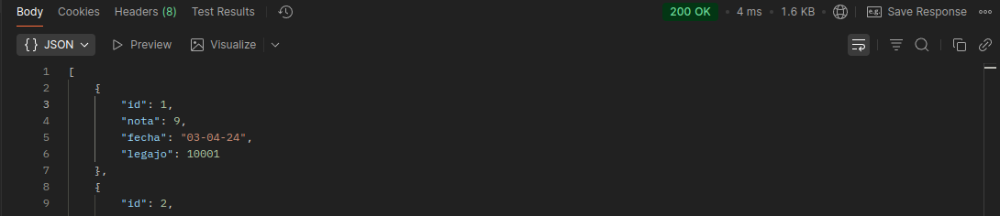
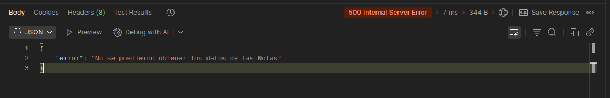

#### Obtener notas por legajo

```bash
curl --location 'http://127.0.0.1:3000/notas/10002'
```

Salida Exitosa (200):

```json
[
  {
    "id": 3,
    "nota": 10,
    "fecha": "03-04-24",
    "legajo": 10002
  },
  {
    "id": 4,
    "nota": 8,
    "fecha": "01-07-24",
    "legajo": 10002
  }
]
```

Salida Erronea (404/500):
{
"error": "Legajo No encontrado"
}

#### Screenshoot

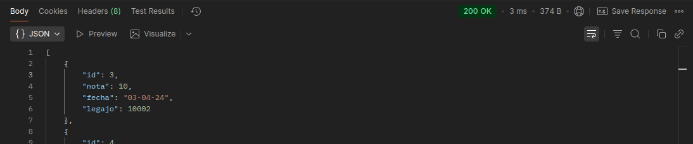
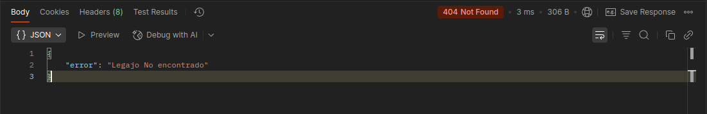
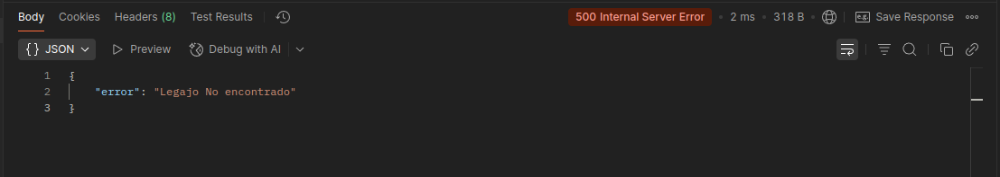

#### Post Nota

```bash
curl --location 'http://127.0.0.1:3000/notas/' \
--header 'Content-Type: application/json' \
--data '{
    "legajo": 1003,
    "idMateria": "PROG1",
    "nota": 10,
    "fecha": "03-04-26"
}'
```

Salida Exitosa (200):

```json
[
        ...
        ...

    {
        "id": 25,
        "nota": 10,
        "fecha": "01-07-24",
        "legajo": 10023
    },
    {
        "id": 26,
        "nota": 10,
        "fecha": "03-04-26",
        "legajo": 1002
    },
    {
        "id": 27,
        "idMateria": "PROG1",
        "nota": 10,
        "fecha": "03-04-26",
        "legajo": 1003
    }
]
```

Salida Erronea (400):

```json
{
  "msg": "Datos Invalidos",
  "errores": ["nota debe ser un número entre 0 y 10"]
}
```

#### Screenshoot


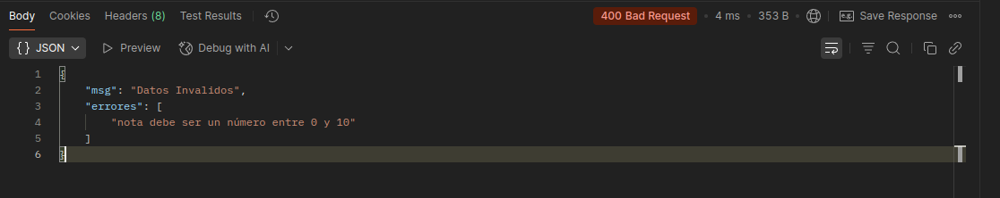
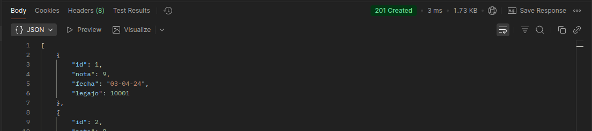

#### Endpoint /profesores

#### Obtener todos los profesores

```bash
curl --location 'https://tp4-grupo6.onrender.com/profesores'
```

Salida Exitosa (200):
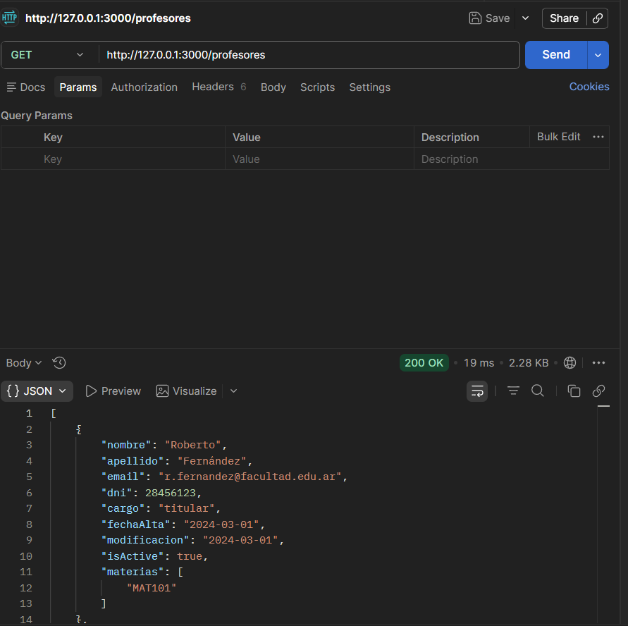

#### Obtener profesor por DNI

```bash
curl --location 'https://tp4-grupo6.onrender.com/profesores/28456123'
```

Salida Exitosa (200):
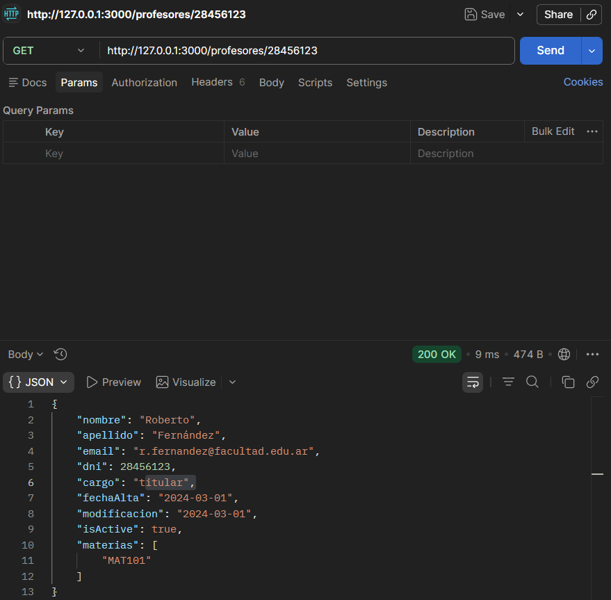

Salida Errónea (404):
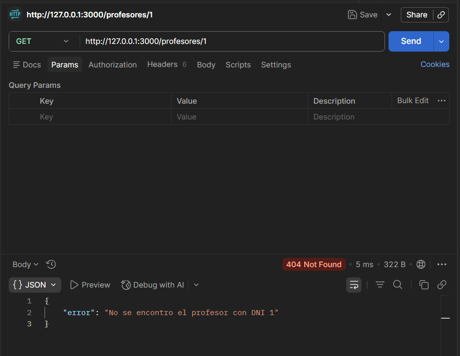

#### Crear profesor

```bash
curl --location 'https://tp4-grupo6.onrender.com/profesores' \
--data-raw '{...}'
```

Salida Exitosa (201):
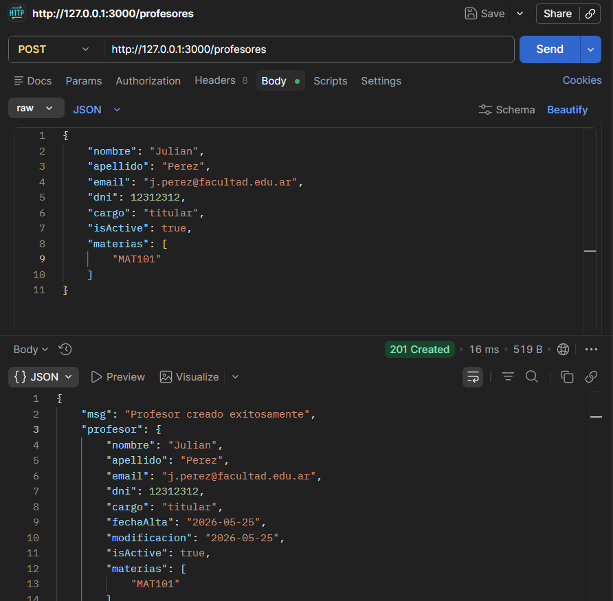

Salida Errónea DNI duplicado (409):
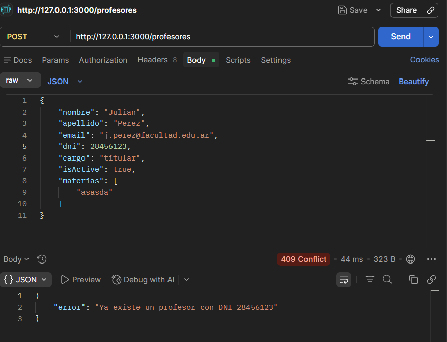

Salida Errónea materia inexistente (400):
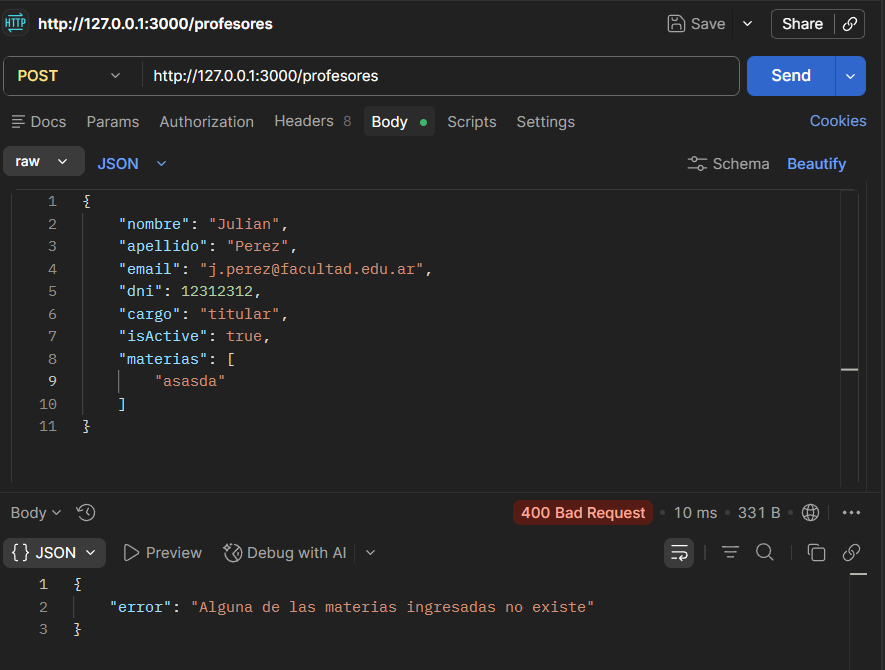
